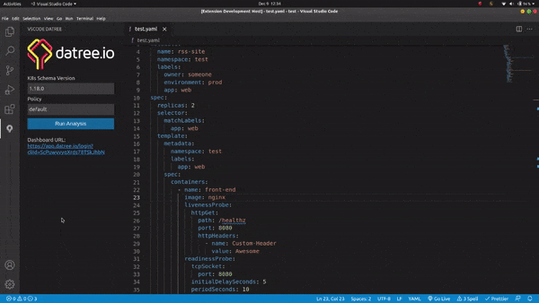
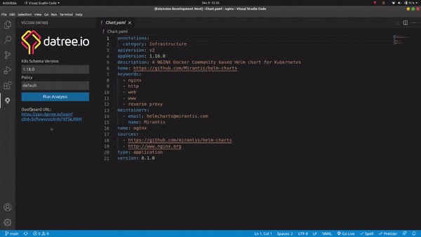

# VSCode Datree

Simple VSCode Extension that allows you to run **Datree** tests on Kubernetes configurations.

Read the article [VSCode Datree: Datree’s power now in your code editor 💪](https://medium.com/@suyashsonawane/vscode-datree-datrees-power-now-in-your-code-editor-747c9cfee610) to know more about how Datree features are implemented

# Features

- Helm Support
- YAML Errors Highlighting
- K8s Schema Error Highlighting
- Ability to change test configuration.
- Solution Suggestions

## Helm Support

Helm `Chart.yml` can be easily tested by the same flow  
_Requires helm plugin installed, can be installed from [datree helm plugin](https://hub.datree.io/helm-plugin)_

# Requirements

- [Datree](https://www.datree.io/)
- [Helm](https://helm.sh/docs/intro/install/) (only required to run helm tests)

# Known Issues

- Error highlighting is limited, due to CLI restrictions

# Release Notes

### 0.2.0
- Support for new improved datree-cli (v0.15.0)
- Support for .yml files
### 0.1.0
- Windows platform is now supported 💯 
- Icon update and Holiday theme 🎉
- Option to ignore missing schema
### 0.0.1
- Initial release of extension 🚀

# Acknowledgement

  
This extension is built for **Datree** as a part of Cloud Native Hackathon
